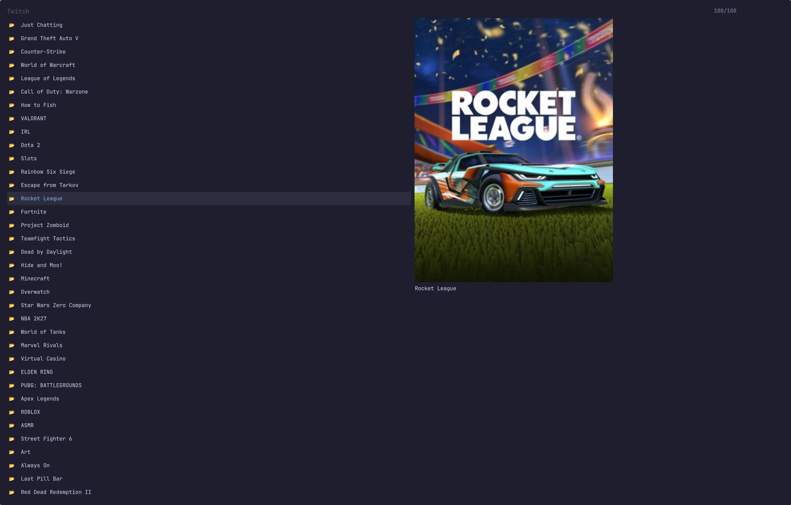

# Twitch Float

Browse Twitch and play a stream in a small window that floats above everything
and follows you from workspace to workspace. Made for
[Omarchy](https://omarchy.org/).

Your live follows come first, with viewer counts and thumbnails, then
categories, top channels, and search.



## Install

```bash
omarchy plugin add https://github.com/jcputney/omarchy-media-float-twitch.git --enable
~/.config/omarchy/plugins/io.github.jcputney.media-float-twitch/setup
omarchy restart shell
```

The plugin and the command are separate halves, so there are two installers.
`omarchy plugin add` hands the shell the picker overlay. `setup` installs the
`twitch-float` command, the window rules, and checks you have mpv and streamlink.

The restart is the third line because the shell caches plugin QML once it has
loaded it — without it, the picker you just installed stays dark.

`setup --check` reports what is installed. `setup --uninstall` takes back
everything it wrote.

## Sign in

```bash
twitch-float auth
```

You get a short code and a URL. Approve it in your browser and the tool picks up
the token by itself. Tokens go to `~/.config/twitch-float/tokens`, mode 0600.

Signing in is what gets you your own follows. Categories, top channels and
search work signed out.

### About the client ID

This ships with a client ID registered for the tool. A Twitch client ID is a
public identifier, not a secret — it appears in the browser on every Twitch page
you visit. The app is registered as **public**, so sign-in uses the device flow
and there is no client secret anywhere in this repo or on your disk.

Prefer your own? Register an app at
[dev.twitch.tv/console/apps](https://dev.twitch.tv/console/apps) with OAuth
redirect `http://localhost` and type **Public**, then:

```bash
echo 'TWITCH_CLIENT_ID=your_id_here' >> ~/.config/twitch-float/config
```

## Use it

```bash
twitch-float browse             # follows, categories, top, search
twitch-float play <channel>     # straight to one channel
twitch-float quality toggle     # 720p60 <-> source, restarts the stream
twitch-float language de        # filter discovery to one language
twitch-float language --list    # every code it accepts
```

`Search categories…` looks up a game or category by name and drops you into
its live streams. `Browse categories…` is the same thing for the top 100
without typing.

## Language

The first screen has a `🌐  Language` row. Pick one and it sticks — it is saved
to `~/.config/twitch-float/language` and applies to every later session until
you change it.

It filters **top streams, categories and channel search**. Twitch filters the
first two server-side, so you get a full hundred results in your language
rather than a hundred filtered down to six. Channel search is filtered here,
because Helix accepts a `language` parameter on that endpoint and then ignores
it.

**Your own follows are never filtered.** Following someone is a stronger signal
than a language preference, and hiding a channel you chose to follow because it
streams in another language would be a bug rather than a feature.

There is no "categories you follow" list, because Twitch's public API has no
endpoint for one — `/channels/followed` returns channels only. The categories
tab on twitch.tv is served by a private API this plugin cannot use.

Every menu below the first level has a `←  Back` row at the top, and Escape
steps back one level rather than closing. Escape on the first level closes the
picker, as before.


Add keybindings to `~/.config/hypr/bindings.lua` — `setup` prints these rather
than editing the file, because which keys are free is your business:

```lua
o.bind("SUPER + ALT + T", "Twitch: browse and play", "twitch-float browse")
o.bind("SUPER + ALT + SHIFT + T", "Twitch: toggle stream quality", "twitch-float quality toggle")
o.bind("SUPER + ALT + SHIFT + P", "Overlay: hide/show", "float-overlay toggle")
o.bind("SUPER + ALT + CTRL + P", "Overlay: close", "float-overlay quit")
o.bind("SUPER + ALT + O", "Overlay: cycle size", "float-overlay size cycle")
```

`float-overlay` drives whichever overlay is up, so the same three control keys
work for the Plex and YouTube tools too.

While something is playing: `SUPER` + right-drag resizes the window freehand,
`SUPER + ALT + O` cycles it through four preset sizes, and the screen will not
blank or lock.

## Remove it

Two commands, mirroring the install:

```bash
~/.config/omarchy/plugins/io.github.jcputney.media-float-twitch/setup --uninstall
omarchy plugin remove io.github.jcputney.media-float-twitch
```

`setup --uninstall` removes the `twitch-float` command, the shared `float-overlay`
command and library, `~/.config/hypr/media-float.lua`, and the marked block it
added to `hyprland.lua`. It leaves the shared pieces alone if another
media-float tool is still installed, and it never touches keybindings you added
yourself.

Your settings are deliberately left behind, so reinstalling does not make you
sign in again. Delete them yourself if you want them gone:

```bash
rm -rf ~/.config/twitch-float
```

That directory holds your Twitch tokens.

## Requirements

`mpv`, `streamlink`, `jq`, `curl`, `hyprctl`, `socat`, `xdg-utils`.

`fzf`, `chafa` and `ghostty` are optional. They are the fallback menu, used when
the shell plugin is disabled or you are not on Omarchy — the whole tool works
without the plugin, just in a terminal window instead of a native overlay.
`notify-send` is optional too; without it errors go to the terminal only.

## Related

- [omarchy-media-float-plex](https://github.com/jcputney/omarchy-media-float-plex)
- [omarchy-media-float-youtube](https://github.com/jcputney/omarchy-media-float-youtube)

Install any one of them on its own. Installed together they share the player
window, the overlay controls and the Hyprland rules.

## Licence

MIT.
